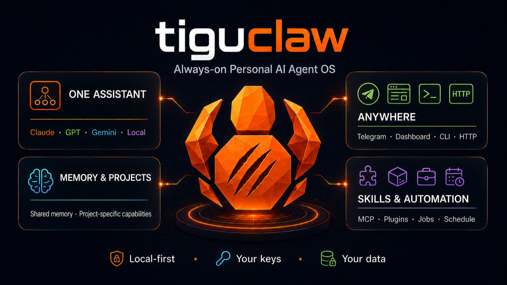
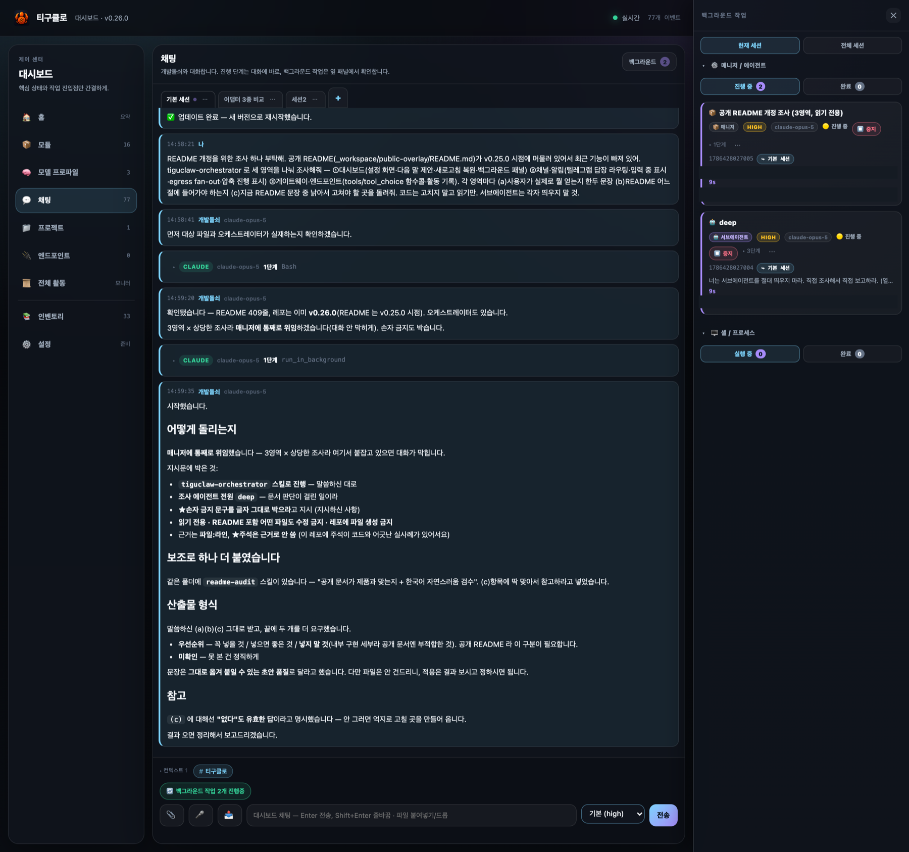

<!-- TODO: assets/demo.gif 로 교체 — 목표 지시 → 매니저가 서브에이전트 붙이는 과정 → 결과, 30초 이내 -->

# tiguclaw

[English](README.md) · **한국어**

[](https://github.com/tigu77/tiguclaw/actions/workflows/ci.yml)
[](https://github.com/tigu77/tiguclaw/releases)
[](LICENSE)
[](https://nodejs.org)

**에이전트를 늘릴수록 관리할 것도 같이 늘어납니다.**
tiguclaw 은 **비서 한 명하고만 이야기하면 되도록** 만든 상시 AI 비서입니다.
목표를 말하면 조직은 비서가 알아서 꾸립니다. 내 컴퓨터에서, 내 키와 내 봇으로.

<p align="center">
  
</p>

**바로 깔아보려면 → [빠른 시작](#빠른-시작)** (받아서 `onboard` 한 번, 끝입니다).

## 데모

<!-- TODO: assets/demo.gif — 목표 지시 → 매니저가 서브에이전트 붙이는 과정 → 결과, 30초 이내.
     그전까지는 대시보드 스크린샷이 자리를 지킵니다. -->

<p align="center">
  
  <br><sub>웹 대시보드 — 일하는 과정이 한 스텝씩, 오른쪽 패널에서 매니저·서브에이전트가 도는 걸 그대로 봅니다.</sub>
</p>

## 왜 만들었나

AI 도구가 강해질수록 사람이 관리할 것도 같이 늘어납니다. 에이전트를 만들고, 역할을 정하고,
누구에게 맡길지 고르고, 모델을 고르고, 병렬로 돌리고, 실패한 걸 다시 돌리고, 결과를 모으고.
그러면 AI 가 일을 대신하는 게 아니라 **내가 AI 조직의 관리자**가 됩니다.

tiguclaw 은 그 반대로 갑니다. 나는 **비서 한 명**과 이야기하고 목표를 말합니다. 조직은 목표
크기에 맞춰 비서가 꾸립니다.

## 누가 무엇을 책임지나

```text
나 ──목표──▶ 메인 비서 ──┬──▶ 매니저 ──┬──▶ 서브에이전트
                         │              ├──▶ 서브에이전트
             결과 ◀──────┤              └──▶ 서브에이전트
                         └──▶ 서브에이전트
```

- **메인 비서 — 관계를 책임집니다.** 내가 계속 이야기하는 그 비서입니다. 맥락·기억·프로젝트를
  들고 있고, 이 일을 직접 할지 누구에게 맡길지 정합니다.
- **매니저 — 목표를 책임집니다.** 오래 걸리는 일을 대신 돌리는 처리기가 아니라 **현장
  지휘자**입니다. 받은 목표를 스스로 쪼개 서브에이전트를 붙이고, 돌아온 결과를 보고 목표가
  됐는지 판단합니다. **결과를 거두기 전에는 끝나지 않습니다** — 이건 부탁이 아니라 코어가
  강제합니다.
- **서브에이전트 — 맡은 일을 책임집니다.** 조사·구현·검증 같은 한 가지를 하고 부른 쪽에
  돌려줍니다.

깊이는 **여기서 멈춥니다.** 매니저는 또 매니저를 띄울 수 없고, 서브에이전트는 아무도 못
띄웁니다. 넓게는 필요한 만큼 벌리되 깊게는 안 내려갑니다 — 무한 위임에서 오는 비용 폭증·책임
경계 흐려짐·"언제 끝나는지 모름" 을 피하려는 의도된 제약입니다.

기본은 **관찰**입니다. 대시보드에서 지금 누가 무엇을 하는지 보고, 필요하면 지시를 얹거나
멈출 수 있습니다. 하지만 그러지 않아도 목표가 끝나는 것이 기본값입니다.

## 빠른 시작

**Node 20+**, **git**, **LLM provider 하나**(아래), 그리고 (선택) **텔레그램 봇** 이 필요합니다.

> ⚠️ 먼저 [`docs/security.md`](docs/security.md) 를 읽어주세요 — 비서는 *내* 컴퓨터의 쉘·파일에
> 접근할 수 있고(Claude Code 와 같은 자기-선택 모델), **파괴적이거나 되돌릴 수 없는 작업 전에는
> 반드시 승인을 받습니다**.

```bash
# macOS · Linux
curl -fsSL https://raw.githubusercontent.com/tigu77/tiguclaw/main/install.sh | sh
```

```powershell
# Windows (PowerShell — 관리자 권한 불요)
irm https://raw.githubusercontent.com/tigu77/tiguclaw/main/install.ps1 | iex
```

받고, 설치하고, 설정 마법사까지 이어집니다. 기본 위치는 홈 아래 `tiguclaw/` — 바꾸려면
`TIGUCLAW_DIR` 를 지정하세요. 필요한 건 **Node.js 20 이상 + git** 뿐이고, 이미 설치돼 있으면
덮지 않고 알려줍니다. (LTS — **20 · 22 · 24** — 를 권합니다. 네이티브 모듈 미리 빌드된
바이너리가 LTS 기준이라, 비-LTS 홀수 버전에서는 C++ 빌드 도구가 필요할 수 있습니다.)

<details>
<summary><b>직접 하고 싶다면</b> (같은 일을 손으로)</summary>

```bash
git clone https://github.com/tigu77/tiguclaw.git && cd tiguclaw
node bin/tiguclaw.mjs onboard   # 의존성 설치까지 알아서 — 이 한 줄이 전부
```

의존성이 없으면 `onboard` 가 먼저 깔고 진행합니다(`npm ci` 를 따로 칠 필요 없음).
설치가 끝나면 전역 `tiguclaw` 명령이 생기고, 그다음부터는 **`tiguclaw update`** 하나로
받고·설치하고·빌드하고·재시작까지 됩니다.
</details>

끝입니다. `onboard` 하나가 전부 안내해줘요: LLM 고르고, 키 붙여넣고(또는 텔레그램 봇 토큰
인식), `.env`·상시 서비스·검증까지 한 번에. 그다음 **텔레그램 봇에게 메시지**를 보내면
답합니다. (입력한 소유자 ID 만 허용 — allowlist 가 비면 봇은 잠깁니다.)

### 대시보드 열기

웹 대시보드는 데몬이 알아서 같이 띄웁니다 — 따로 실행할 명령이 없어요. 데몬이 떠 있으면:

**http://127.0.0.1:7010**

여기가 본격 채팅 UI 입니다 — 도구 실행이 한 스텝씩 실시간으로, 답은 흐르듯, 세션 탭,
백그라운드 작업 패널까지. 7010 이 이미 쓰이고 있으면 `.env` 의 `DASHBOARD_PORT` 로 바꾸세요.

> **일부러 로컬 전용입니다.** 대시보드는 `127.0.0.1` 에만 바인딩되고 브라우저 로그인이
> 없습니다 — bridge 토큰은 서버 쪽에서 주입돼 페이지엔 안 닿으니, **이 포트에 닿는 것 자체가
> 곧 권한**이에요. 폰에서 쓰고 싶으면 포트를 열지 말고 사설 네트워크로 터널링하세요(예:
> `tailscale serve 7010`). `DASHBOARD_HOST=0.0.0.0` 은 그 대가를 알 때만.
>
> 원격을 **이름**(예: MagicDNS `*.ts.net`)으로 여실 거면 그 이름을 `.env` 의
> `DASHBOARD_ALLOWED_HOSTS` 에 적어주세요 — DNS 리바인딩 방어 때문입니다. **IP 로
> 접속하면 설정이 필요 없습니다.** 안 적어서 막히면 403 응답이 그 방법을 알려줍니다.

대시보드가 안 보이면 십중팔구 `HTTP_BRIDGE_TOKEN` 이 없는 겁니다 — 데몬 로그에
`dashboard: HTTP_BRIDGE_TOKEN not set … spawn skipped` 가 찍혀요. `npm run onboard` 가 자동
생성하고, `npm run doctor` 가 확인해 줍니다.

### provider 고르기

LLM 하나는 있어야 합니다. **Ollama**(무료·로컬·키 불필요)부터 **Anthropic·OpenAI API 키**,
**Claude/ChatGPT 구독**, 그리고 **OpenAI 호환 엔드포인트라면 무엇이든**(OpenRouter·Groq·vLLM…)
됩니다. `onboard` 가 물어보며 안내하고, 나중에 바꿔도 능력은 그대로입니다.

→ 키 발급 방법·설정 예시·평소 쓰는 명령·업데이트·삭제는 **[설치와 운영](docs/setup.md)** 에
모아뒀습니다.

### 추론 강도 바꾸기

모델이 **얼마나 깊게 생각할지**를 조절할 수 있습니다. 설정 파일을 열 필요 없이 **말로** 하면
됩니다:

> "codex sol 추론 강도 high 로 올려줘" · "opus 는 기본값으로 되돌려줘"

값은 벤더 등급을 그대로 씁니다(`low` · `medium` · `high` · `xhigh` · `max` — 모델마다 지원
범위가 다릅니다). 비워서 말하면 **해제**되어 그 모델의 설계 기본값으로 돌아갑니다. 저장 즉시
다음 턴부터 반영되고 재시작은 필요 없습니다. 지금 무엇이 걸려 있는지는 대시보드의 **모델**
화면에 배지로 보입니다.

> ⚠️ 강도를 올리면 **출력·비용·지연이 함께 오릅니다.** (실측: 어떤 모델을 설계 기본인 `low`
> 로 명시했더니 출력이 37% 줄었습니다.) 필요한 작업에만 올리고, 끝나면 되돌리세요.

**잘 안 되면** 먼저 `tiguclaw doctor` 를 돌려보세요 — 키·홈·서비스·네이티브 모듈·전역 명령까지
한 번에 점검하고, 막힌 자리에 맞는 조치를 알려줍니다. 그래도 안 되면
[이슈](https://github.com/tigu77/tiguclaw/issues/new/choose)로 알려주세요. 보안 문제는 공개 이슈
말고 [SECURITY](.github/SECURITY.md) 를 봐주세요.

## 뭘 하나

여섯 가지입니다. 나머지는 전부 [전체 기능 목록](docs/features.md)에 있습니다.

1. **항상 켜져 있음** — 백그라운드 서비스로 상시 실행되고, 죽으면 스스로 재시작하며,
   부탁하면("업데이트해줘" 또는 `/update`) 스스로 최신화합니다. 새 코드가 빌드되지 않으면
   이전 버전으로 롤백해 계속 돌아갑니다.
2. **어디로 들어와도 같은 비서** — 텔레그램·CLI·HTTP·웹 대시보드. 하나의 인격, 공유된 기억.
   폰에서 시작한 대화를 책상에서 그대로 이어갑니다.
3. **하는 일마다 대화 하나** — 세션은 창이 아니라 **대화 단위**입니다. 탭으로 늘어놓고,
   여러 개를 서로 막지 않게 동시에 돌리고, 나중에 다른 채널에서 이어받습니다. 검색은
   모든 세션을 훑고, 원하면 한 세션으로 좁혀집니다.
4. **목표를 통째로 위임** — 큰 일은 **매니저**에게 넘깁니다. 매니저가 스스로 서브에이전트를
   붙이고, **결과를 거두기 전엔 끝나지 않습니다.** 그동안 대화는 계속됩니다.
5. **여러 LLM 을 하나의 능력 표면으로** — `anthropic`·`openai`·`codex`(ChatGPT)·`ollama`(로컬)·
   `google`, 그리고 OpenAI 호환이면 무엇이든. 프로바이더 간 자동 폴백에, 어느 모델에서나 같은 도구.
6. **말로 확장** — 새 슬래시 명령·HTTP 엔드포인트·예약 작업·재사용 스킬을 코어 패치 없이
   홈 아래 *데이터*로 추가합니다.
7. **데이터는 내 컴퓨터에** — 세션·메모리·DB 전부 로컬(`~/.tiguclaw`)에.

그리고 **Claude Code 의 형식을 그대로** 씁니다 — 같은 도구, 같은 `settings.json` 의 `hooks`
블록, 같은 스킬 배치. 쓰던 것이 그대로 넘어옵니다.

## 더 읽을 것

| | |
|---|---|
| [설치와 운영](docs/setup.md) | 키·설정·평소 명령·업데이트·삭제 |
| [전체 기능 목록](docs/features.md) | 위 여섯 가지에 안 담긴 전부 |
| [훅](docs/hooks.md) | 도구 호출 관찰·차단 — Claude Code `hooks` 포맷 |
| [LLM 게이트웨이](docs/gateway.md) | 내 앱의 OpenAI 호환 백엔드로 쓰기 |
| [보안](docs/security.md) | 비서가 닿을 수 있는 것, 하기 전에 묻는 것 |
| [코드 지도](docs/code-map.md) · [코어 경계](docs/core-boundaries.md) | 무엇이 어느 파일에 · 부팅·라우팅·권한의 흐름 |
| [기여 안내](CONTRIBUTING.md) | 변경이 반영되는 방식 |

## 핵심 원칙

무엇을 만들지 정할 때 먼저 묻는 것: **이 기능이 사용자에게 새로운 관리 대상을 만드는가.**
만든다면 비서나 매니저가 대신 맡을 수 없는지 다시 봅니다. 에이전트를 더 쉽게 관리하게
만들기보다 **관리하지 않아도 되게** 만들고, 모델 선택지를 늘리기보다 알아서 고르게 하고,
워크플로우 편집기를 두기보다 목표에서 실행 계획이 나오게 합니다. 설정을 늘리는 것보다
합리적인 기본값이 먼저입니다.

1. **관리 대상을 늘리지 않는다** — 위 질문을 모든 기능에 적용합니다.
2. **항상 떠있다** — 스스로 재시작하는 상시 데몬.
3. **다채널 단일 인격** — 어느 채널로 들어와도 하나의 비서.
4. **멀티 LLM 동시 사용** — 작업별로 다른 모델을, 어댑터 무관하게 같은 능력으로.
5. **진짜 일만 직접 만든다** — 코어는 최소로, 나머지는 데이터(컨벤션·prompt·skill·hook·
   memory)로 확장.

## 변경 이력

릴리스 노트는 [`CHANGELOG.md`](CHANGELOG.md) 참조 (이 프로젝트는 [SemVer](https://semver.org/) 를
따릅니다).

## 감사의 말

tiguclaw 는 몇몇 오픈소스 프로젝트 위에 서 있습니다.

- **[OpenClaw](https://github.com/openclaw/openclaw)** (MIT, © Peter Steinberger)
  — 어댑터·능력 설계의 많은 부분에 영향을 줬습니다. codex OAuth 어댑터, 스킬 발견,
  payload 정책 모두 OpenClaw 가 닦아놓은 패턴을 따릅니다.
- 하네스 메타 스킬(서브에이전트 팀 + 오케스트레이션)은
  **[revfactory/harness](https://github.com/revfactory/harness) 를 적응·이식**
  (Apache-2.0) 했습니다 — tiguclaw 의 홈/스킬 모델과 멀티 LLM·서브에이전트 전용
  런타임에 맞게 수정.
- 그리고 tiguclaw 는 Anthropic 의 **Claude Agent SDK** 위에 만들어졌고, **Claude Code** 의
  도구·훅·스킬 형식을 그대로 지원합니다.

세 곳 모두에 깊이 감사드립니다.

## 라이선스

Apache License 2.0 — [`LICENSE`](LICENSE) 참조.

> v0.21.1 까지는 MIT 였습니다. 그때 받아 간 버전은 계속 MIT 조건으로 쓸 수 있고, Apache-2.0 은
> 그 이후 버전부터 적용됩니다.
