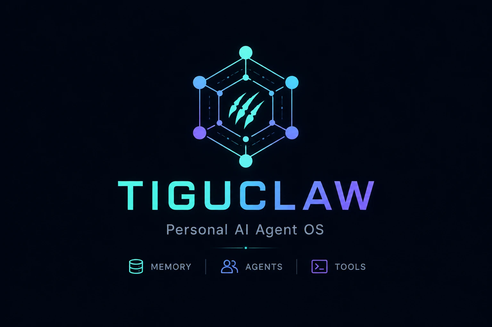

# tiguclaw

[English](README.md) · **한국어**

항상 켜져 있는 내 AI 비서. Claude Code 가 하는 모든 걸 하면서, 여러 LLM 을 동시에 쓰고, 텔레그램·내장 웹 대시보드·CLI·HTTP 어디서든 하나의 비서로 만난다. 내 컴퓨터에, 내 키와 내 봇으로 직접 돌린다.

> 잠들지 않는 Claude Code 가 텔레그램으로 말을 걸고, Claude·GPT·Gemini·무료 로컬 모델을 같은 능력으로 골라 쓰는 느낌.

<p align="center">
  
</p>

## 뭘 하나

- **Claude Code 의 모든 것** — 파일 읽기 / 쓰기 / 편집, 쉘 실행, 웹 검색, 스킬, 서브에이전트, 훅, 슬래시 명령, 영구 메모리… 그 위에 더.
- **여러 LLM, 하나의 비서** — `anthropic`·`openai`·`codex`(ChatGPT)·`ollama`(로컬)·`google`(Gemini)을 `provider:model` 한 줄로 섞어 쓴다. 바꿔도 능력은 그대로.
- **항상 켜짐** — 백그라운드 서비스로 상시 실행, 죽으면 스스로 재시작.
- **부탁하면 스스로 업데이트** — "업데이트해줘" 한마디(또는 `/update`)면 최신 코드를 받아 재시작하고, 다 되면 알려준다. 손으로 `git pull` 할 필요 없음. 기억·세션은 그대로 이어지고, 새 코드가 실행 가능하게 빌드되지 않으면 이전 버전으로 롤백해 계속 돌아간다.
- **텍스트 말고 버튼으로 묻는다** — 고르라고 할 때 누를 수 있는 보기를 띄운다(텔레그램·대시보드는 버튼, CLI는 번호). 어느 채널이든 똑같이.
- **타이핑 대신 말로** — 텔레그램에 음성 메시지를 보내거나 대시보드 마이크를 꾹 누르고 말하면, 받아 적고 바로 일을 시작한다. 전사도 다른 능력처럼 설정으로 고른다 — 로컬 모델이든 클라우드든.
- **일하는 중에 끼어들 수 있다** — 비서가 작업 중일 때 메시지를 보내면, 턴이 끝나길 기다리거나 처음부터 다시 시키지 않고 진행 중인 작업에 그대로 반영한다.
- **다채널 단일 인격** — 텔레그램·CLI·HTTP, 그리고 내장 웹 대시보드 어디로 들어와도 같은 비서, 대화 맥락 공유. 대시보드는 제대로 된 채팅이다 — 일하는 과정이 한 스텝씩 실시간으로 뜨고(각 단계가 무엇을 건드렸는지까지), 답은 흐르듯 타이핑되고, 재시작해도 대화 기록이 남는다. 옆 패널에선 백그라운드 작업의 상태·단계·결과를 지켜볼 수 있어, 긴 일을 대화에서 벗어나지 않고 확인한다.
- **무거운 일도 사소한 일도 위임** — 긴 작업은 백그라운드 워커에 맡겨 대화를 끊지 않고, 단순 작업은 무료 로컬 모델(`nano`)에 넘긴다.
- **일하면서 배운다** — 자기 실수가 반복되면 그걸 운영 교훈으로 정리해 다음엔 따르고, 재사용할 만한 워크플로우다 싶으면 — 처음 보는 것이라도 — 알맞은 자리(프로젝트 전용/공통)의 스킬로 만들자고 제안한다. 전부 *제안 → 승인* — 몰래 자기를 고치지 않는다.
- **자기 이상을 스스로 알아챈다** — 최근 기록을 훑어 조용히 잘못된 것(도착 안 한 예약 알림, 죽은 작업 같은)을 찾아 먼저 보고한다. 되돌릴 수 있는 안전한 조치 — 그 알림 한 번 다시 보내기 같은 — 는 알아서 하고 알려주며, 나머지는 사용자에게 가져온다.
- **데이터는 내 컴퓨터에** — 세션·메모리·DB 전부 로컬(`~/.tiguclaw`)에.

## 이런 게 특별하다

평범한 챗봇과 다른 지점 몇 가지:

- **로그가 아니라 진짜 웹 대시보드.** 브라우저로 열면 비서가 생각하고 일하는 걸 실시간으로 본다 — 추론과 도구 실행이 일어난 순서대로 인터리브되고(Claude Code 웹앱처럼), 도구 카드엔 diff·출력이 리치하게 뜨고, 재시작해도 스크롤백이 남는다. 여러 대화는 세션 탭으로 나란히 돌아간다(순서 바꾸기·탭별 입력 초안 보존). 옆 패널은 백그라운드 작업을 단계별 타임라인으로 추적하고, 선택지는 탭으로 답하고, 특정 메시지에 답글을 달거나 `#태그`로 맥락을 잡는다.
- **주머니에 들어간다.** 대시보드는 데스크톱을 우겨넣은 게 아니라 진짜 모바일 UI다 — 서랍 내비게이션, 마스터-디테일 패널, 폰 키보드에서 제대로 동작하는 입력창. 소파에서 오래 걸리는 작업을 확인하거나 일을 시켜두고, 책상에서 같은 대화로 이어서 끝낸다.
- **프로젝트.** `PROJECT.md` 가 있는 폴더를 가리키면 그 프로젝트 전용 스킬·서브에이전트·MCP 도구를 집어 든다 — 프로젝트마다 딱 맞는 능력으로 위임한다.
- **외부 MCP 서버를 즉석에서 연결.** MCP 서버를 추가해달라고 하면 그 외부 도구를 배선한다 — 전역으로든 특정 프로젝트로든, 코어는 안 건드리고. Claude Code MCP 파리티, 그 이상.
- **내가 통제하는 모델 티어.** 모델 프로파일(`default`·`high`·`mid`·`low`)을 크로스-프로바이더 풀 + 자동 폴백으로 이름 붙인다. 메인 턴은 한 티어, 서브에이전트·워커는 다른 티어로 돈다 — 대화로 편집하거나 `/models` 로 목록을 본다.
- **일하는 걸 지켜본다.** 서브에이전트와 오래 걸리는 워커가 추적 가능한 잡으로 돌아, 대시보드에서 상태·단계·결과를 따라본다. Claude Code 의 Task 도구를, 관측 가능하게.
- **말로 확장한다.** 새 슬래시 명령·HTTP 엔드포인트·예약 작업·재사용 스킬 — 코어를 패치하지 않고 홈 아래 *데이터*로 추가한다(그래서 업데이트가 깨끗하게 유지된다).
- **내 앱의 LLM 백엔드로 쓴다.** OpenAI 호환 클라이언트를 내장 게이트웨이(`POST /v1/chat/completions`·`GET /v1/models`)로 향하게 하면, 내 앱이 이 풀을 그대로 물려받는다 — 프로바이더 간 자동 폴백, 이미지 입력, 함수 호출 그대로 통과, 원하면 스트리밍까지. 프로바이더마다 SDK 하나씩 대신 엔드포인트 하나로. 게이트웨이 토큰을 넣기 전엔 꺼져 있고, 응답은 *내 앱*으로 나간다 — 비서 인격이 새지 않는다.
- **얼마 썼는지, 그리고 무엇이 답했는지 보인다.** 매 턴의 입력·출력 토큰과 캐시 적중률이 채팅에 바로 뜬다 — 낭비가 짐작이 아니라 숫자로 보인다. 답변·도구 실행·백그라운드 작업마다 *실제로* 응답한 모델이 함께 붙는다 — 한도에 걸려 폴백으로 넘어가면 내가 지정한 등급과 달라지기 때문이다. 쉬고 있는 모델은 `/status` 가 이름으로 알려준다.
- **모든 모델에서 도는 훅.** `settings.json` 에 Claude Code 식 `hooks` 블록을 넣으면 도구 호출을 관찰하거나 차단한다(턴 앞뒤도). 그 *같은* 설정이 `anthropic`·`codex`·`openai` 어디서 턴이 돌든 똑같이 동작한다. [훅](#훅) 참고.

## 뭘 시킬 수 있나

유능한 팀원한테 말하듯 — 텔레그램·CLI·HTTP 어디서든. 예시 몇 개:

**코드 & 내 컴퓨터**
- "`~/projects/api` 의 실패한 테스트 고치고 브랜치 하나 따줘."
- "디스크 뭐가 잡아먹는지 보고 확실한 쓰레기만 정리해줘." *(삭제 전엔 꼭 물어봅니다)*
- "이 파일들 읽고 인증이 어떻게 도는지 설명해줘."

**조사 & 글쓰기**
- "오늘 AI 뉴스 조사해서 짧게 요약해줘."
- "이 메시지에 답장 초안 써줘: …"
- "내 용도에 두 라이브러리 비교하고 하나 추천해줘."

**오래 걸리는 일도 기다림 없이**
- "이 40개 페이지 긁어서 표로 만들어줘." → 무거운 일은 백그라운드 워커에 넘기고 대화는 계속, 끝나면 알려줍니다.
- 반복·대량·단순 작업은 무료 로컬 모델에 위임.

**기억 & 예약**
- "나 TypeScript 랑 공백 2칸 선호하는 거 기억해." → 모든 대화에 걸쳐 유지.
- "평일 아침 9시마다 X 요약해서 보내줘."
- "지난주 DB 관련해서 우리 뭐로 정했지?"

**그냥 말로, 내 비서로 만들기**
- "질문 3개 물어보는 `/standup` 명령 추가해줘." → 명령을 등록(텔레그램 메뉴도 실시간 갱신).
- "내 다른 앱이 호출할 HTTP 엔드포인트 하나 열어줘." → 코어 안 건드리고 연결.
- "이 작업 흐름을 재사용 스킬로 만들어줘."

**어디서든** — 폰(텔레그램)·터미널(CLI)·내 앱(HTTP). 같은 비서, 같은 기억.

> 내 컴퓨터의 쉘·파일에 접근할 수 있고, **파괴적이거나 되돌릴 수 없는 작업 전에는 반드시 승인을 받습니다**([`docs/security.ko.md`](docs/security.ko.md)).

## 빠른 시작

**Node 20+**, **git**, **LLM provider 하나**(아래), 그리고 (선택) **텔레그램 봇** 이 필요합니다.

> ⚠️ 먼저 [`docs/security.ko.md`](docs/security.ko.md) 를 읽어주세요 — 비서는 *내* 컴퓨터의 쉘·파일에 접근할 수 있습니다(Claude Code 와 같은 자기-선택 모델).

```bash
git clone https://github.com/tigu77/tiguclaw.git && cd tiguclaw
npm ci            # lockfile 그대로 깨끗·재현 설치 (또는: npm install)
npm run onboard   # 대화형 설정 → .env → (codex)로그인 → 서비스 등록 → 검증
```

끝입니다. `onboard` 하나가 전부 안내해줘요: LLM 고르고, 키 붙여넣고(또는 텔레그램 봇 토큰 인식), `.env`·상시 서비스·검증까지 한 번에. 그다음 **텔레그램 봇에게 메시지**를 보내면 답합니다. (입력한 소유자 ID 만 허용 — allowlist 가 비면 봇은 잠깁니다.)

### 대시보드 열기

웹 대시보드는 데몬이 알아서 같이 띄웁니다 — 따로 실행할 명령이 없어요. 데몬이 떠 있으면:

**http://127.0.0.1:7010**

여기가 본격 채팅 UI 입니다 — 도구 실행이 한 스텝씩 실시간으로, 답은 흐르듯, 세션 탭, 백그라운드 작업 패널까지. 7010 이 이미 쓰이고 있으면 `.env` 의 `DASHBOARD_PORT` 로 바꾸세요.

> **일부러 로컬 전용입니다.** 대시보드는 `127.0.0.1` 에만 바인딩되고 브라우저 로그인이 없습니다 — bridge 토큰은 서버 쪽에서 주입돼 페이지엔 안 닿으니, **이 포트에 닿는 것 자체가 곧 권한**이에요. 폰에서 쓰고 싶으면 포트를 열지 말고 사설 네트워크로 터널링하세요(예: `tailscale serve 7010`). `DASHBOARD_HOST=0.0.0.0` 은 그 대가를 알 때만.

대시보드가 안 보이면 십중팔구 `HTTP_BRIDGE_TOKEN` 이 없는 겁니다 — 데몬 로그에 `dashboard: HTTP_BRIDGE_TOKEN not set … spawn skipped` 가 찍혀요. `npm run onboard` 가 자동 생성하고, `npm run doctor` 가 확인해 줍니다.

### provider 고르기

| provider | 방법 |
|---|---|
| **Ollama (로컬)** | 키 불필요·무료·오프라인. Ollama 만 설치하면 끝. (작은 모델 = 품질 낮음.) |
| **Anthropic API 키** | console.anthropic.com 에서 발급 — 가장 쉬움, 종량제. |
| **Claude 구독** | Claude Pro/Max 구독 사용 — `claude setup-token` 실행 (API 키 불필요, 종량 과금 없음). |
| **OpenAI API 키** | platform.openai.com — 종량제. |
| **codex (ChatGPT 구독)** | 설치 후 `npm run codex-auth` 로 로그인. |

### 키·토큰 발급 가이드

단계별 — 고른 provider 1개 (+ 채팅 원하면 텔레그램 봇) 만 있으면 됩니다. `onboard` 가 각 항목을 물어보며 이 힌트를 인라인으로 보여줍니다.

**텔레그램 봇 토큰** (채팅 인터페이스)
1. 텔레그램에서 **[@BotFather](https://t.me/BotFather)** 열고 `/newbot` 전송.
2. 봇 표시 이름 입력 → 그다음 `bot` 으로 끝나는 username 입력 (예: `my_assistant_bot`).
3. BotFather 가 `123456:ABC-DEF…` 형태 토큰을 줍니다 — 복사.
4. *(권장 — 1:1 전용 잠금)* `/setjoingroups` → **Disable**, `/setprivacy` → **Enable**.

**내 텔레그램 user ID** (소유자 allowlist)
- 가장 쉬움: `onboard` 중에 봇에게 메시지 1번 보내면 ID 자동 감지.
- 수동: **[@userinfobot](https://t.me/userinfobot)** 에게 메시지 → 숫자 `Id` 확인.

**Anthropic API 키** (`sk-ant-…`)
1. **console.anthropic.com** 로그인.
2. **Settings → API Keys → Create Key** → 이름 입력 → 복사 (한 번만 표시됨).
3. **Plans & Billing** 에서 크레딧 충전 (종량제).

**Claude 구독** (API 키 대신 Claude Pro/Max 구독 사용)
1. Claude Code CLI 설치 후 **`claude setup-token`** 실행.
2. 브라우저에서 로그인 → 장기 토큰이 출력됨 → 복사.
3. `CLAUDE_CODE_OAUTH_TOKEN` 으로 붙여넣기 (마법사의 **claude-sub** 옵션, 또는 `.env`). 종량 과금 없이 구독으로 동작.

**OpenAI API 키** (`sk-…`)
1. **platform.openai.com** 로그인.
2. **API keys → Create new secret key** → 복사.
3. **Billing** 에서 크레딧 충전.

**Google Gemini 키** (선택)
1. **aistudio.google.com** → **Get API key → Create API key** → 복사. (무료 한도 넉넉.)

**codex (ChatGPT 구독)** — *붙여넣을 키 없음*
- 설치 후 `npm run codex-auth` 실행 → 로그인 URL 열림 → ChatGPT 로그인 → 권한 허용. 토큰 자동 저장·갱신. (ChatGPT Plus/Pro 구독 필요.)

**Ollama (로컬)** — *키 없음*
1. **ollama.com** 에서 설치 (macOS는 `brew install ollama`).
2. 모델 받기: `ollama pull llama3.2` (품질 원하면 `ollama pull qwen2.5:7b`).

### 평소 사용

- **어디서나 제어** — `onboard` 가 `npm link` 를 자동 실행해, 어느 폴더에서나 `tiguclaw status | restart | stop | start | logs | doctor | uninstall` 가 됩니다(진짜 앱처럼). *(레포 안에선 `npm run daemon:*` 도 가능.)*
- **서비스 관리**(macOS / Linux / Windows 공통 명령): `npm run daemon:status | daemon:restart | daemon:stop | daemon:start | daemon:logs`.
- **일시정지 vs 제거** — `daemon:stop` 은 실행만 멈추고 등록은 유지합니다(다음 로그인 때 다시 자동 가동). `daemon:start` 로 재개. 완전히 없애려면 `daemon:uninstall`.
- **뭔가 이상하면?** `npm run doctor` 가 키·봇 도달·홈·서비스를 점검합니다.

참고:

- `.env` 에는 봇 토큰·LLM 키가 들어 있어요 — **절대 커밋·공유 금지**(이미 gitignore 처리됨).
- LLM 사용 **비용은 본인 부담**(본인 키 / 구독).
- 설치는 **`npm ci`** 권장 — `package-lock.json` 그대로 결정적으로 깔고 lockfile 을 수정하지 않습니다. `npm install` 도 되지만 lockfile 을 로컬에서 살짝 바꿀 수 있어요(그 변경은 커밋 안 해도 됨).
- `npm run daemon:install` 은 OS별로 상시 서비스를 등록합니다:
  - **macOS** → launchd (crash 자동 재시작·로그인 시 가동).
  - **Linux** → systemd **user** 서비스 (`Restart=always`). 로그인 없이 부팅 가동하려면: `loginctl enable-linger $USER`.
  - **Windows** → 레지스트리 Run 키(HKCU — **관리자 권한 불요**; 로그온 시 숨김 가동). crash 자동재시작 없음; 완전한 KeepAlive 는 **WSL2** 권장.
  - KeepAlive 강도는 솔직히 macOS > Linux > Windows 순. 위 관리 명령은 3 OS 모두 동일합니다.
- **의존성이 깨져도 관리 명령은 항상 됩니다** — install / uninstall / restart / stop / start 는 순수 Node 로만 돕니다(빌드·`tsx` 불필요). 그래서 `node_modules` 가 깨졌거나 없어도 서비스를 멈추거나 제거할 수 있습니다. `npm ci` 가 파일 잠금 오류(네이티브 모듈 `EPERM`)로 실패하면 실행 중인 데몬이 그 파일을 잡고 있는 것이니, `tiguclaw stop`(또는 `npm run daemon:stop`) → `npm ci` → `tiguclaw start` 순서로 풀면 됩니다.

### 업데이트

그냥 **"업데이트해줘"** 라고 하거나 `/update` 를 보내면 됩니다. 최신 코드를 받아 재시작하고, 다 되면 알려줍니다. 기억·세션·설정은 그대로 이어집니다 — 업데이트는 코드만 건드리고 데이터는 손대지 않아요. 새 코드가 실행 가능한 형태로 빌드되지 않으면 이전 버전으로 롤백해 계속 돌아갑니다(데몬이 죽는 일은 없습니다).

직접 하려면 레포에서 `git pull && npm run daemon:restart`. *(built 모드라면 재시작 전에 `npm run build:prod` 를 먼저 — 인앱 업데이트는 이걸 자동으로 해줍니다.)*

### 재설치 · 런타임 모드

**재설치 / 복구** — `npm run onboard`(또는 `npm run daemon:install`)를 다시 실행하면 서비스 등록을 그 자리에서 덮어씁니다. 레포 폴더를 옮겼거나 서비스가 이상해졌을 때 쓰면 돼요 — 데이터는 건드리지 않고 안전합니다.

**런타임 모드** — `npm run onboard` 는 기본으로 **컴파일된 빌드**를 설치합니다: `dist/` 로 컴파일한 뒤 `node dist/src/index.js` 로 구동해요 — 부팅이 빠르고 실행 중 변환이 없습니다. 따로 할 건 없습니다.

**TypeScript 소스**로 바로 돌리고 싶다면 — 빌드 단계가 없고 업데이트가 받는 즉시 적용됩니다(개발할 때 편함) — `TIGUCLAW_RUNTIME=source` 로 설치하세요:

```bash
TIGUCLAW_RUNTIME=source npm run onboard
```

모드는 설치할 때 고정되어 저절로 바뀌지 않습니다 — 업데이트는 고른 모드를 유지합니다(built 설치는 자동 재컴파일, 업데이트마다 몇 초 추가). 나중에 바꾸려면 `TIGUCLAW_RUNTIME` 을 지정하고 install 을 다시 실행하세요.

### 삭제 (Uninstall)

1. **서비스 중지·제거** — `npm run daemon:uninstall` (macOS launchd / Linux systemd user / Windows 레지스트리 Run 공통).
2. **데이터 삭제** — ⚠️ 되돌릴 수 없음 (세션·메모리·DB·agents·skills): `rm -rf ~/.tiguclaw` (또는 `TIGUCLAW_HOME` 이 가리키는 경로).
3. **전역 명령 제거** (`npm link` 했을 때만) — `npm rm -g tiguclaw`.
4. **프로젝트 폴더 삭제** — `rm -rf tiguclaw`.
5. *(선택)* 외부 정리 — **@BotFather** 에서 봇 삭제(`/deletebot`), 콘솔에서 API 키 폐기, 받은 로컬 모델은 `ollama rm <모델>`.

## 어떻게 만들어졌나

- **코어** — 단일 LLM 런타임(어댑터 풀: claude / codex / openai / ollama / google) + 라우터 + SQLite 스토어(세션·메모리·transcripts).
- **채널** — 텔레그램 / CLI / HTTP 어댑터가 추상 의도를 채널별로 렌더.
- **플러그인** — 스케줄러(cron)·파일 워치·대시보드·http-bridge(대시보드 API + OpenAI 호환 게이트웨이)·self-growth(학습·제안) — 코어를 안 건드리고 확장.
- **능력은 데이터** — `<home>/` 아래 에이전트·스킬·메모리·훅으로 무한 확장(마이크로커널 + 플러그인 생태).

## 훅

훅은 정해진 순간에 비서가 실행하는 셸 명령이다 — 하는 일을 관찰하거나, 어떤 동작을 실행 전에 차단한다. **Claude Code `settings.json` 의 `hooks` 포맷을 그대로** 쓰기 때문에, 이미 Claude Code 훅을 써봤다면 그대로 넘어온다.

배선된 이벤트는 네 가지다:

| 이벤트 | 발화 시점 | 대표 용도 |
|---|---|---|
| `UserPromptSubmit` | 턴 시작 전 | 들어오는 프롬프트 로깅·게이팅 |
| `PreToolUse` | 도구 실행 전 | 도구 호출 **차단**(예: 특정 경로 쓰기 거부) |
| `PostToolUse` | 도구 반환 후 | 도구 결과 관찰·감사 |
| `Stop` | 턴 종료 후 | 턴 후 알림·로깅 |
| `SubagentStop` | 위임한 서브에이전트 종료 후 | 백그라운드·서브에이전트 완료에 반응 |

각 훅은 stdin 으로 작은 JSON payload(`tool_name`·`tool_input`·`cwd` 등)를 받는다. `PreToolUse` 는 exit code `2` 로 도구를 차단한다 — 비서는 도구 결과 자리에 (stderr 로 넘긴) 사유를 보고 넘어간다. 그 외 non-zero exit 은 격리·로깅되어, 훅이 깨져도 데몬은 절대 죽지 않는다.

`<home>/settings.json` 에 블록을 추가한다. 선택 `matcher` 는 도구 이름에 대한 정규식이다(빈값 = 모든 도구):

```jsonc
{
  "hooks": {
    "PreToolUse": [
      {
        "matcher": "Write|Edit",
        "hooks": [
          { "type": "command", "command": "~/.tiguclaw/hooks/guard-writes.sh" }
        ]
      }
    ],
    "PostToolUse": [
      {
        "matcher": "",
        "hooks": [
          { "type": "command", "command": "~/.tiguclaw/hooks/audit.sh" }
        ]
      }
    ]
  }
}
```

가드 스크립트는 허용한 디렉터리 밖 쓰기를 exit `2` 로 거부할 수 있다:

```bash
#!/usr/bin/env bash
read -r payload
path=$(printf '%s' "$payload" | jq -r '.tool_input.file_path // empty')
case "$path" in
  "$HOME"/projects/*) exit 0 ;;              # 허용
  *) echo "쓰기는 ~/projects 아래에서만 허용됩니다" >&2; exit 2 ;;  # 차단
esac
```

알아둘 것 몇 가지:

- **같은 설정이 모든 LLM 에서 돈다.** 하나의 `settings.json` `hooks` 블록이 `anthropic`·`codex`·`openai` 어디서 턴이 돌든 똑같이 동작한다 — 단일 훅 엔진이 셋 다 굴리므로, 프로바이더별로 따로 배울 것도 관리할 것도 없다.
- **프로젝트별 훅.** `<project>/.tiguclaw/settings.json` 에 `hooks` 블록을 넣으면, 비서가 그 폴더에서 일할 때 홈 훅과 *병합*되어 함께 발화한다 — 프로젝트 규칙과 전역 규칙이 둘 다 돈다(override 아님).
- **눈으로 볼 수 있다.** 훅 실행은 대시보드 활동 모니터에 뜨고(차단은 붉은 틴트), 등록된 훅은 대시보드 인벤토리 **🪝 훅** 카테고리에 나온다.

지금 훅은 도구 호출의 **관찰과 차단**을 다룬다. 더 세밀한 제어 — 도구 입력을 고쳐 넣거나 맥락을 주입하는 것 — 는 다음 단계로 계획돼 있다.

## LLM 게이트웨이

내가 만든 앱이 tiguclaw 의 프로바이더 풀을 **OpenAI 호환 API** 로 빌려 쓴다 — 프로바이더마다 SDK 하나씩 대신 엔드포인트 하나로, 비서가 쓰는 크로스-프로바이더 폴백을 그대로.

**토큰을 주기 전엔 꺼져 있다.** `<home>/.env` 에 하나 넣는다:

```bash
LLM_GATEWAY_TOKEN=<충분히 긴 랜덤 문자열>
```

그다음 OpenAI 클라이언트를 http-bridge 포트(기본 `7011`, `127.0.0.1` 바인드)로 향하게 한다:

```bash
curl http://127.0.0.1:7011/v1/chat/completions \
  -H "Authorization: Bearer $LLM_GATEWAY_TOKEN" \
  -H "Content-Type: application/json" \
  -d '{
    "model": "tier:high",
    "messages": [
      { "role": "system",  "content": "너는 내 앱의 어시스턴트다." },
      { "role": "user",    "content": "이걸 한 줄로 요약해줘: …" }
    ]
  }'
```

| 경로 | 되는 것 |
|---|---|
| `POST /v1/chat/completions` | `"stream": true` 스트리밍(SSE 청크), `image_url` 이미지 입력, 내가 정의한 `tools` 를 모델에 그대로 통과. |
| `GET /v1/models` | `model` 에 넣을 수 있는 id 목록 — 명명 프로파일은 `tier:<이름>`, 그리고 설정된 `provider:model` 들. |

`model` 에는 `provider:model`(`anthropic:claude-sonnet-4-6`), 명명 풀을 쓰는 `tier:<프로파일>`, 또는 그 외 아무 값(= 게이트웨이 기본 풀로 폴백)을 넣는다.

`<home>/settings.json` 에서 돌아가는 중에 조절한다 — 매 요청 새로 읽으므로 재시작이 필요 없다:

```jsonc
{
  "gateway": {
    "enabled": true,        // 킬 스위치 — 토큰은 둔 채로 끈다
    "models": ["tier:high", "openai:gpt-5.5"],
    "maxConcurrency": 4     // 넘으면 429 — 앱이 폭주해도 비서가 굶지 않는다
  }
}
```

알아둘 것:

- **비서가 아니라 내 앱으로 답한다.** `system` 메시지가 그대로 쓰이고 — tiguclaw 인격도, 도구도, 스킬도, 기억도 없다 — 게이트웨이 호출은 내 대화나 대시보드에 남지 않는다.
- **브라우저 말고 앱 *서버* 에서 호출한다.** 토큰은 공유 비밀이고, 포트는 로컬호스트만 듣는다.
- **비서와 다른 백엔드를 권한다.** 앱이 비서가 얹혀 사는 구독을 두들기면 양쪽에서 체감된다.

## 핵심 원칙

1. **Claude Code 슈퍼셋** — Claude Code 의 모든 능력을 포함하고 그 위에 확장.
2. **멀티 LLM 동시 사용** — 작업별로 다른 모델을, 어댑터 무관하게 같은 능력으로.
3. **항상 떠있다** — 스스로 재시작하는 상시 데몬.
4. **다채널 단일 인격** — 어느 채널로 들어와도 하나의 비서.
5. **진짜 일만 직접 만든다** — 코어는 최소로, 나머지는 데이터(컨벤션·prompt·skill·hook·memory)로 확장.

## 변경 이력

릴리스 노트는 [`CHANGELOG.md`](CHANGELOG.md) 참조 (이 프로젝트는 [SemVer](https://semver.org/) 를 따릅니다).

## 감사의 말

tiguclaw 는 몇몇 오픈소스 프로젝트 위에 서 있습니다.

- **[OpenClaw](https://github.com/openclaw/openclaw)** (MIT, © Peter Steinberger)
  — 어댑터·능력 설계의 많은 부분에 영향을 줬습니다. codex OAuth 어댑터, 스킬 발견,
  payload 정책 모두 OpenClaw 가 닦아놓은 패턴을 따릅니다.
- 하네스 메타 스킬(서브에이전트 팀 + 오케스트레이션)은
  **[revfactory/harness](https://github.com/revfactory/harness) 를 적응·이식**
  (Apache-2.0) 했습니다 — tiguclaw 의 홈/스킬 모델과 멀티 LLM·서브에이전트 전용
  런타임에 맞게 수정.
- 그리고 tiguclaw 는 **Claude Code** 의 슈퍼셋이며 Anthropic 의
  **Claude Agent SDK** 위에 만들어졌습니다.

세 곳 모두에 깊이 감사드립니다.

## 라이선스

MIT — [`LICENSE`](LICENSE) 참조.
