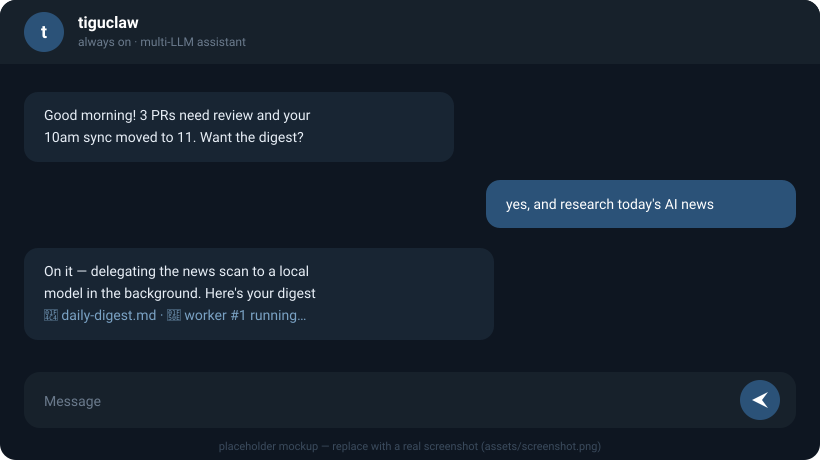

# tiguclaw

[English](README.md) · **한국어**

항상 켜져 있는 내 AI 비서. Claude Code 가 하는 모든 걸 하면서, 여러 LLM 을 동시에 쓰고, 텔레그램·CLI·HTTP 어디서든 하나의 비서로 만난다. 내 컴퓨터에, 내 키와 내 봇으로 직접 돌린다.

> 잠들지 않는 Claude Code 가 텔레그램으로 말을 걸고, Claude·GPT·Gemini·무료 로컬 모델을 같은 능력으로 골라 쓰는 느낌.

<p align="center">
  
</p>

## 뭘 하나

- **Claude Code 의 모든 것** — 파일 읽기 / 쓰기 / 편집, 쉘 실행, 웹 검색, 스킬, 서브에이전트, 훅, 슬래시 명령, 영구 메모리… 그 위에 더.
- **여러 LLM, 하나의 비서** — `anthropic`·`openai`·`codex`(ChatGPT)·`ollama`(로컬)·`google`(Gemini)을 `provider:model` 한 줄로 섞어 쓴다. 바꿔도 능력은 그대로.
- **항상 켜짐** — 백그라운드 서비스로 상시 실행, 죽으면 스스로 재시작.
- **다채널 단일 인격** — 텔레그램·CLI·HTTP 어디로 들어와도 같은 비서, 대화 맥락 공유.
- **무거운 일도 사소한 일도 위임** — 긴 작업은 백그라운드 워커에 맡겨 대화를 끊지 않고, 단순 작업은 무료 로컬 모델(`nano`)에 넘긴다.
- **데이터는 내 컴퓨터에** — 세션·메모리·DB 전부 로컬(`~/.tiguclaw`)에.

## 빠른 시작

**Node 20+**, **git**, **LLM provider 하나**(아래), 그리고 (선택) **텔레그램 봇** 이 필요합니다.

> ⚠️ 먼저 [`docs/security.md`](docs/security.md) 를 읽어주세요 — 비서는 *내* 컴퓨터에 쉘·파일 접근 권한을 가집니다(Claude Code 와 같은 자기-선택 모델).

```bash
git clone https://github.com/tigu77/tiguclaw.git && cd tiguclaw
npm install
npm run onboard   # 대화형 설정 → .env → (codex)로그인 → 서비스 등록 → 검증
```

끝입니다. `onboard` 하나가 전부 안내해줘요: LLM 고르고, 키 붙여넣고(또는 텔레그램 봇 토큰 인식), `.env`·상시 서비스·검증까지 한 번에. 그다음 **텔레그램 봇에게 메시지**를 보내면 답합니다. (입력한 소유자 ID 만 허용 — allowlist 가 비면 봇은 잠깁니다.)

### provider 고르기

| provider | 방법 |
|---|---|
| **Ollama (로컬)** | 키 불필요·무료·오프라인. Ollama 만 설치하면 끝. (작은 모델 = 품질 낮음.) |
| **Anthropic API 키** | console.anthropic.com 에서 발급 — 가장 쉬움, 종량제. |
| **Claude 구독** | Claude Pro/Max 구독 사용 — `claude setup-token` 실행 (API 키 불필요, 종량 과금 없음). |
| **OpenAI API 키** | platform.openai.com — 종량제. |
| **codex (ChatGPT 구독)** | 설치 후 `npm run codex-auth` 로 로그인. |

### 키·토큰 발급 가이드

단계별 — 고른 provider 1개 (+ 채팅 원하면 텔레그램 봇) 만 있으면 됩니다. `onboard` 가 각 항목을 물어보며 이 힌트를 인라인으로 보여줍니다.

**텔레그램 봇 토큰** (채팅 인터페이스)
1. 텔레그램에서 **[@BotFather](https://t.me/BotFather)** 열고 `/newbot` 전송.
2. 봇 표시 이름 입력 → 그다음 `bot` 으로 끝나는 username 입력 (예: `my_assistant_bot`).
3. BotFather 가 `123456:ABC-DEF…` 형태 토큰을 줍니다 — 복사.
4. *(권장 — 1:1 전용 잠금)* `/setjoingroups` → **Disable**, `/setprivacy` → **Enable**.

**내 텔레그램 user ID** (소유자 allowlist)
- 가장 쉬움: `onboard` 중에 봇에게 메시지 1번 보내면 ID 자동 감지.
- 수동: **[@userinfobot](https://t.me/userinfobot)** 에게 메시지 → 숫자 `Id` 확인.

**Anthropic API 키** (`sk-ant-…`)
1. **console.anthropic.com** 로그인.
2. **Settings → API Keys → Create Key** → 이름 입력 → 복사 (한 번만 표시됨).
3. **Plans & Billing** 에서 크레딧 충전 (종량제).

**Claude 구독** (API 키 대신 Claude Pro/Max 구독 사용)
1. Claude Code CLI 설치 후 **`claude setup-token`** 실행.
2. 브라우저에서 로그인 → 장기 토큰이 출력됨 → 복사.
3. `CLAUDE_CODE_OAUTH_TOKEN` 으로 붙여넣기 (마법사의 **claude-sub** 옵션, 또는 `.env`). 종량 과금 없이 구독으로 동작.

**OpenAI API 키** (`sk-…`)
1. **platform.openai.com** 로그인.
2. **API keys → Create new secret key** → 복사.
3. **Billing** 에서 크레딧 충전.

**Google Gemini 키** (선택)
1. **aistudio.google.com** → **Get API key → Create API key** → 복사. (무료 한도 넉넉.)

**codex (ChatGPT 구독)** — *붙여넣을 키 없음*
- 설치 후 `npm run codex-auth` 실행 → 로그인 URL 열림 → ChatGPT 로그인 → 권한 허용. 토큰 자동 저장·갱신. (ChatGPT Plus/Pro 구독 필요.)

**Ollama (로컬)** — *키 없음*
1. **ollama.com** 에서 설치 (macOS는 `brew install ollama`).
2. 모델 받기: `ollama pull llama3.2` (품질 원하면 `ollama pull qwen2.5:7b`).

### 평소 사용

- **전역 명령**(선택): `npm link` 후 어디서나 `tiguclaw status | restart | logs`.
- **서비스 관리**(macOS launchd): `npm run daemon:status | daemon:restart | daemon:logs`.
- **뭔가 이상하면?** `npm run doctor` 가 키·봇 도달·홈·서비스를 점검합니다.

참고:

- `.env` 에는 봇 토큰·LLM 키가 들어 있어요 — **절대 커밋·공유 금지**(이미 gitignore 처리됨).
- LLM 사용 **비용은 본인 부담**(본인 키 / 구독).
- 자동 서비스 등록은 현재 **macOS** 에서 검증됨. Linux/Windows 는 수동 supervisor 로 실행(설치기가 명령을 안내).

### 삭제 (Uninstall)

1. **서비스 중지·제거** — `npm run daemon:uninstall` (macOS launchd). *(Linux/Windows 는 supervisor 를 직접 중지.)*
2. **데이터 삭제** — ⚠️ 되돌릴 수 없음 (세션·메모리·DB·agents·skills): `rm -rf ~/.tiguclaw` (또는 `TIGUCLAW_HOME` 이 가리키는 경로).
3. **전역 명령 제거** (`npm link` 했을 때만) — `npm rm -g tiguclaw`.
4. **프로젝트 폴더 삭제** — `rm -rf tiguclaw`.
5. *(선택)* 외부 정리 — **@BotFather** 에서 봇 삭제(`/deletebot`), 콘솔에서 API 키 폐기, 받은 로컬 모델은 `ollama rm <모델>`.

## 어떻게 만들어졌나

- **코어** — 단일 LLM 런타임(어댑터 풀: claude / codex / openai / ollama / google) + 라우터 + SQLite 스토어(세션·메모리·transcripts).
- **채널** — 텔레그램 / CLI / HTTP 어댑터가 추상 의도를 채널별로 렌더.
- **플러그인** — 스케줄러(cron)·파일 워치·대시보드·http-bridge — 코어를 안 건드리고 확장.
- **능력은 데이터** — `<home>/` 아래 에이전트·스킬·메모리·훅으로 무한 확장(마이크로커널 + 플러그인 생태).

## 핵심 원칙

1. **Claude Code 슈퍼셋** — Claude Code 의 모든 능력을 포함하고 그 위에 확장.
2. **멀티 LLM 동시 사용** — 작업별로 다른 모델을, 어댑터 무관하게 같은 능력으로.
3. **항상 떠있다** — 스스로 재시작하는 상시 데몬.
4. **다채널 단일 인격** — 어느 채널로 들어와도 하나의 비서.
5. **진짜 일만 직접 만든다** — 코어는 최소로, 나머지는 데이터(컨벤션·prompt·skill·hook·memory)로 확장.

## 변경 이력

릴리스 노트는 [`CHANGELOG.md`](CHANGELOG.md) 참조 (이 프로젝트는 [SemVer](https://semver.org/) 를 따릅니다).

## 라이선스

MIT — [`LICENSE`](LICENSE) 참조.
